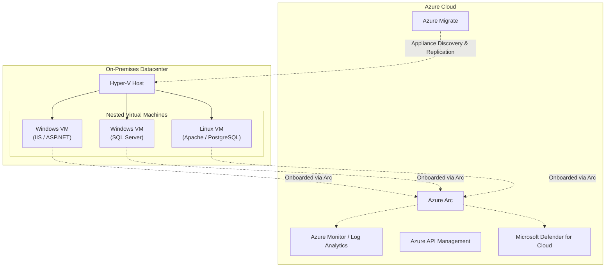

# AzureSessions

This repository contains working assets used for SLED Azure Enablement Sessions, with a focus on Azure Arc scenarios and hands-on deployment content.

## Architecture and Migration Demo

This repository provisions a full-scale Hybrid Cloud environment to demonstrate assessment and modernization using **Azure Migrate** and **Azure Arc**.

The architecture uses a Hyper-V host to simulate a legacy on-premises datacenter. Within this host, nested virtual machines run traditional multi-tier applications:
- **Windows Server (IIS)**: Hosting a legacy ASP.NET Web Forms storefront.
- **Windows Server (SQL)**: Hosting the Microsoft SQL Server AdventureWorks database.
- **Ubuntu Linux**: Hosting a PHP commerce interface backed by a PostgreSQL database.

### Why Hyper-V?
By leveraging Hyper-V to run native nested VMs, this environment accurately replicates an **on-premises datacenter**. This allows us to effectively demonstrate the full lifecycle of a migration journey using **Azure Migrate**:
1. **Discovery & Assessment**: Deploying the Azure Migrate appliance to the Hyper-V host to discover the live VMs, capture performance data, assess cloud readiness, and calculate sizing/costs.
2. **Replication & Migration**: Showing how Azure Migrate securely replicates these running workloads from the Hyper-V host directly into Azure without application downtime.
3. **Hybrid Management**: Onboarding the on-premises servers into Azure Arc for unified management, Defender for SQL, and monitoring alongside native cloud resources.

### Architecture Diagram

## Deploy Migration Demo (ARM)

Use the button below to deploy the migration demo from the ARM template:

