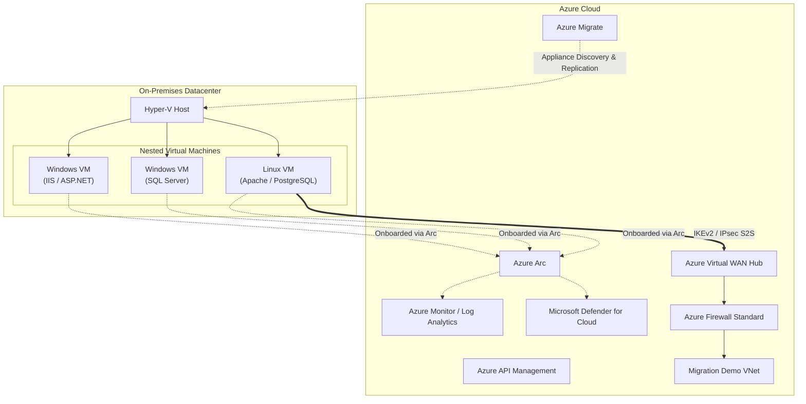

# AzureSessions

This repository contains working assets used for SLED Azure Enablement Sessions, with a focus on Azure Arc scenarios and hands-on deployment content.

## Getting Started Lab Path

Use the guided lab sequence below to run the full demo from a new subscription through migration and modernization outcomes:

1. [Prerequisites - Trial Entra Tenant and Azure Subscription](migration_demo/lab_guides/00-prerequisites-azure-trial-setup.md)
2. [Lab 01 - Azure Deployment](migration_demo/lab_guides/01-azure-deployment.md)
3. [Lab 02 - Login to Host VM](migration_demo/lab_guides/02-login-to-host-vm.md)
4. [Lab 03 - Azure Migrate Setup](migration_demo/lab_guides/03-azure-migrate-setup.md)
5. [Lab 04 - Migrate SQL Server with Azure Database Migration Service](migration_demo/lab_guides/04-sql-database-migration.md)

Each lab guide is written to be runnable independently, but the best experience is to follow them in order.

## Architecture and Migration Demo

This repository provisions a full-scale Hybrid Cloud environment to demonstrate assessment and modernization using **Azure Migrate** and **Azure Arc**.

The architecture uses a Hyper-V host to simulate a legacy on-premises datacenter. Within this host, nested virtual machines run traditional multi-tier applications:
- **Windows Server (IIS)**: Hosting a legacy ASP.NET Web Forms storefront.
- **Windows Server (SQL)**: Hosting the Microsoft SQL Server AdventureWorks database.
- **Ubuntu Linux**: Hosting a PHP commerce interface backed by a PostgreSQL database.

### Why Hyper-V?
By leveraging Hyper-V to run native nested VMs, this environment accurately replicates an **on-premises datacenter**. This allows us to effectively demonstrate the full lifecycle of a migration journey using **Azure Migrate**:
1. **Discovery & Assessment**: Deploying the Azure Migrate appliance to the Hyper-V host to discover the live VMs, capture performance data, assess cloud readiness, and calculate sizing/costs.
2. **Replication & Migration**: Showing how Azure Migrate securely replicates these running workloads from the Hyper-V host directly into Azure without application downtime.
3. **Hybrid Management**: Onboarding the on-premises servers into Azure Arc for unified management, Defender for SQL, and monitoring alongside native cloud resources.

### Architecture Diagram

```mermaid
graph TD
    subgraph Azure Cloud
        Arc[Azure Arc]
        Migrate[Azure Migrate]
        Monitor[Azure Monitor / Log Analytics]
        APIM[Azure API Management]
        Defender[Microsoft Defender for Cloud]
        vWAN[Azure Virtual WAN Hub]
        Firewall[Azure Firewall Standard]
        AzureVNet[Migration Demo VNet]
    end

    subgraph On-Premises Datacenter
        HyperV[Hyper-V Host]
        
        subgraph Nested Virtual Machines
            WinIIS["Windows VM<br>(IIS / ASP.NET)"]
            WinSQL["Windows VM<br>(SQL Server)"]
            Ubuntu["Linux VM<br>(Apache / PostgreSQL)"]
        end
        
        HyperV --> WinIIS
        HyperV --> WinSQL
        HyperV --> Ubuntu
    end

    WinIIS -.-> |Onboarded via Arc| Arc
    WinSQL -.-> |Onboarded via Arc| Arc
    Ubuntu -.-> |Onboarded via Arc| Arc
    Ubuntu ==>|IKEv2 / IPsec S2S| vWAN
    vWAN --> Firewall
    Firewall --> AzureVNet

    Arc -.-> Monitor
    Arc -.-> Defender

    Migrate -.-> |Appliance Discovery & Replication| HyperV
```

The Hyper-V private network (`10.10.1.0/24`) is advertised to the connected Azure VNet through an IKEv2/IPsec site-to-site connection and inspected by Azure Firewall Standard in the secured virtual hub. Azure Virtual WAN does not support OpenVPN for site-to-site connections, so Ubuntu uses strongSwan for the Azure tunnel; OpenVPN is installed and enabled separately for optional lab use. See [Azure Virtual WAN and Hyper-V private networking](migration_demo/VWAN_NETWORKING.md) for the address plan, routes, security policy, and validation flow.

## Deploy Migration Demo (ARM)

Use the button below to deploy the migration demo from the ARM template:

The template defaults resource deployment to Central US because Azure Migrate is not available in every Azure region. Select another region only after confirming that it supports `Microsoft.Migrate/migrateProjects`.

The template registers required subscription features through Azure Resource Manager before creating network resources. The Azure CLI fallback is available at `migration_demo/azure/scripts/Register-DeploymentPrerequisites.sh` for manual deployments.

The deployment includes a Standard Virtual WAN hub, Virtual WAN VPN gateway, and Azure Firewall Standard. These resources accrue hourly charges; delete the demo resource group when the lab is complete.

## Demo Usage Summary

At a high level, run the demo as follows:

1. Prepare the Entra tenant, Azure subscription, and budget controls using [Prerequisites - Trial Entra Tenant and Azure Subscription](migration_demo/lab_guides/00-prerequisites-azure-trial-setup.md).
2. Deploy the migration demo infrastructure using [Lab 01 - Azure Deployment](migration_demo/lab_guides/01-azure-deployment.md).
3. Connect to and validate the nested environment using [Lab 02 - Login to Host VM](migration_demo/lab_guides/02-login-to-host-vm.md).
4. Discover and assess workloads with Azure Migrate using [Lab 03 - Azure Migrate Setup](migration_demo/lab_guides/03-azure-migrate-setup.md).
5. Migrate the SQL Server database to Azure SQL Database using [Lab 04 - Migrate SQL Server with Azure Database Migration Service](migration_demo/lab_guides/04-sql-database-migration.md).
