# Prerequisites: Create an Azure Free Trial and GitHub Account

> **Privacy and session disclaimer:** This setup is intended to provide hands-on experience with the Azure migration demo environment and can be used after the session. Enter account, identity-verification, and payment information directly into the applicable Microsoft or GitHub sign-up experience; do not share passwords, verification codes, payment details, or other personal information with session presenters or other attendees. Microsoft account team members and partners presenting the session do not request or collect this information. Azure and GitHub process information according to their respective privacy statements, applicable terms, and the notices presented during sign-up. A credit card is required only to create the Azure trial in the Azure portal and should be entered before the session. If you are not comfortable or otherwise unwilling to create the trial using credit card information, the demo will be shown step by step during the session for attendees to follow along.

Complete this guide before attending the lab. The goal is to create an Azure Free Account with the introductory $200 Azure credit and a GitHub account for the modernization exercises.

## What you need

- A personal Microsoft account that can be used to sign in to Azure.
- A phone number that can receive verification codes.
- A valid credit card for Azure identity and payment verification.
- An email address that can be used with GitHub.
- A private browser window, or a browser session signed out of other Microsoft accounts.

The Azure Free Account offer is subject to Microsoft's current eligibility, offer, country, and account-history requirements. Review the offer terms shown during sign-up before accepting.

## Create the Azure trial

1. Open [Azure Free Account](https://azure.microsoft.com/free/).
2. Select **Start free**.

   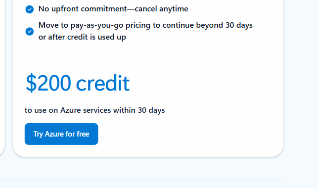

3. Select **Sign up** or **Create an account** if you need a Microsoft account for the trial.

   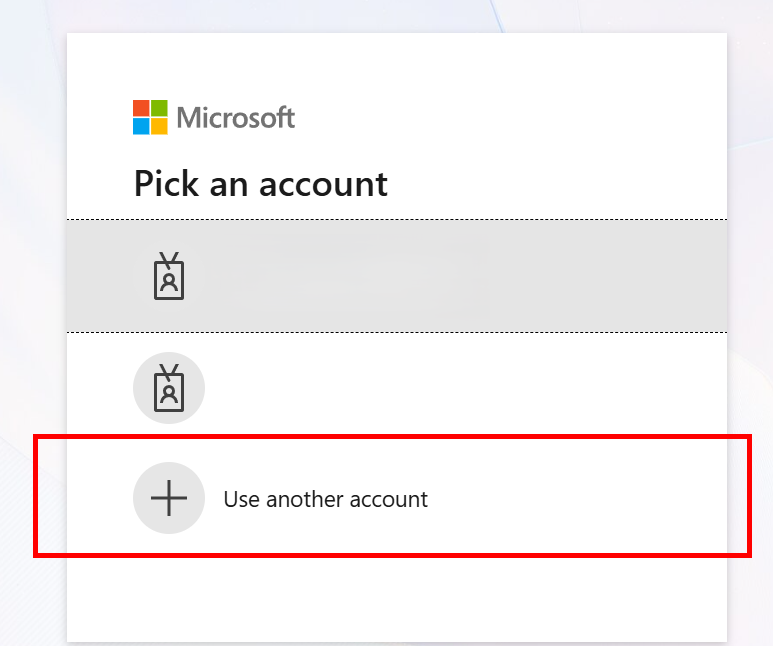

4. If you already have a Microsoft account, select **Sign in**. Otherwise, select **Create one** and follow the account creation prompts. You will need to use and account that has not previously had an Azure trial subscription.

   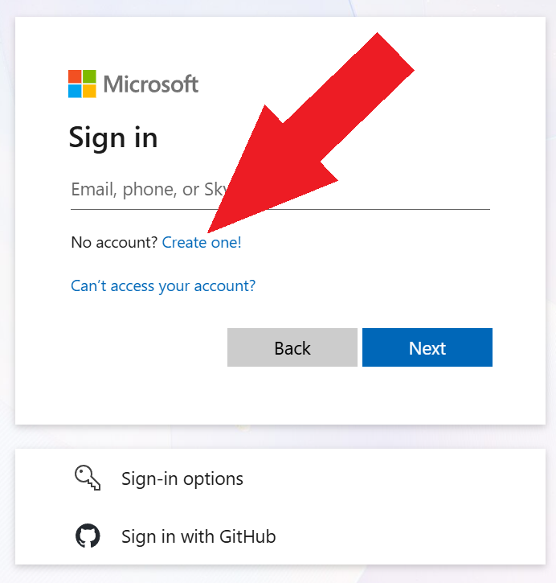

5. Enter an email address to use for the trial. (sample user. pick your own new email address.)

   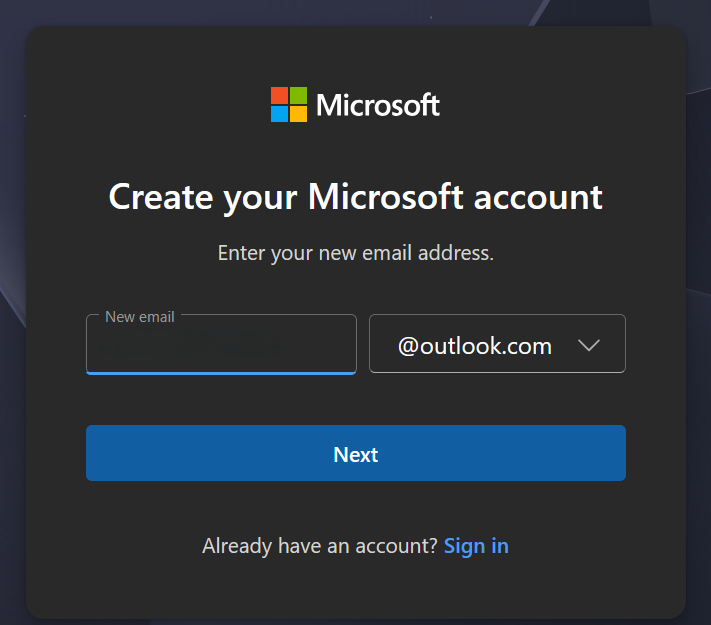

6. Create a password for the Microsoft account.

   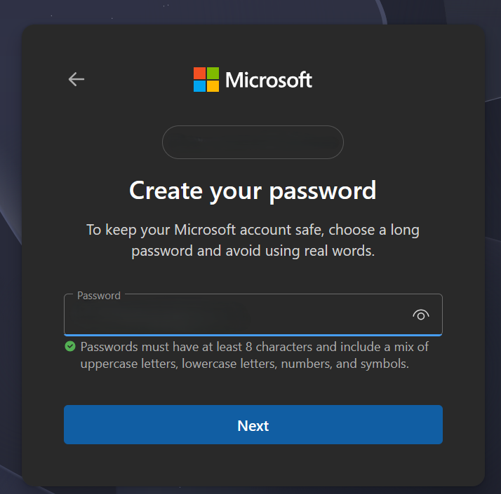

7. Enter the requested name and birth-date information.

   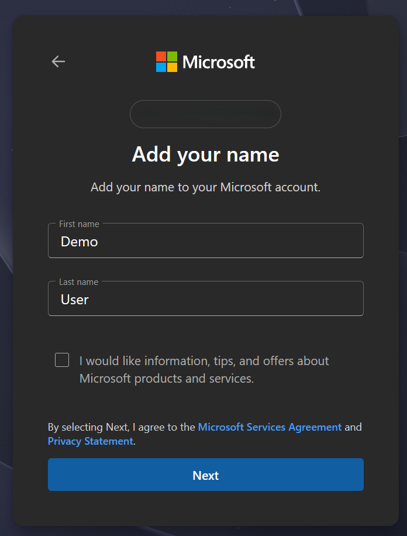

   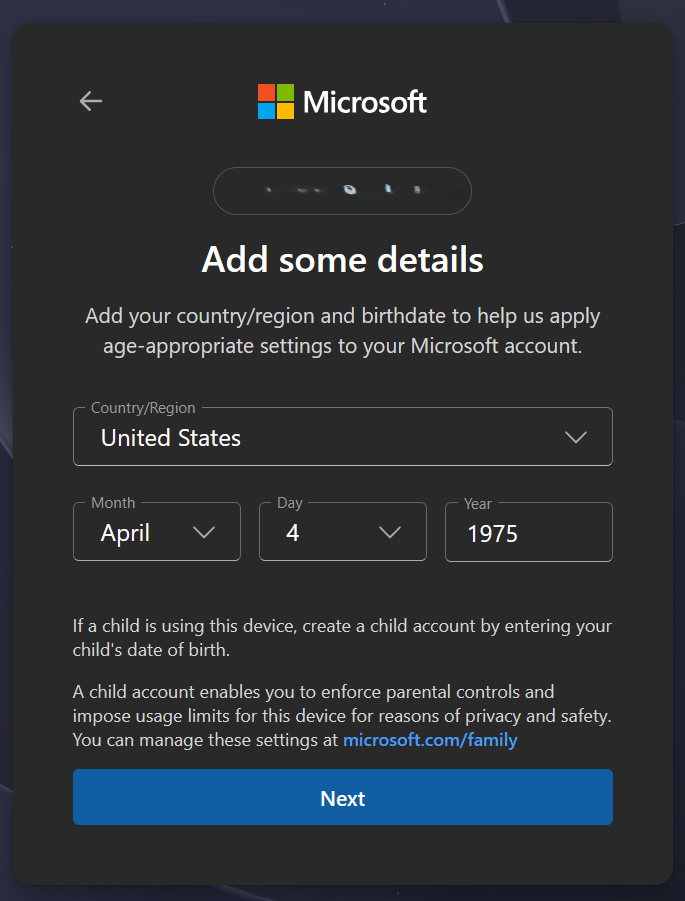

8. Add a backup email address if requested.

   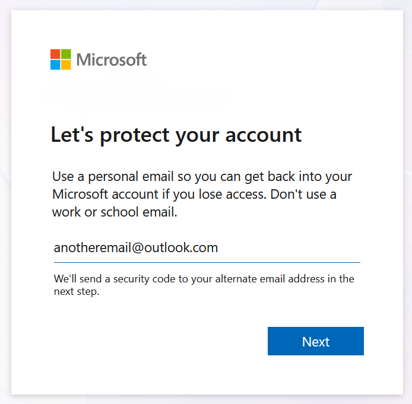

9. Complete the email or identity verification code step.

   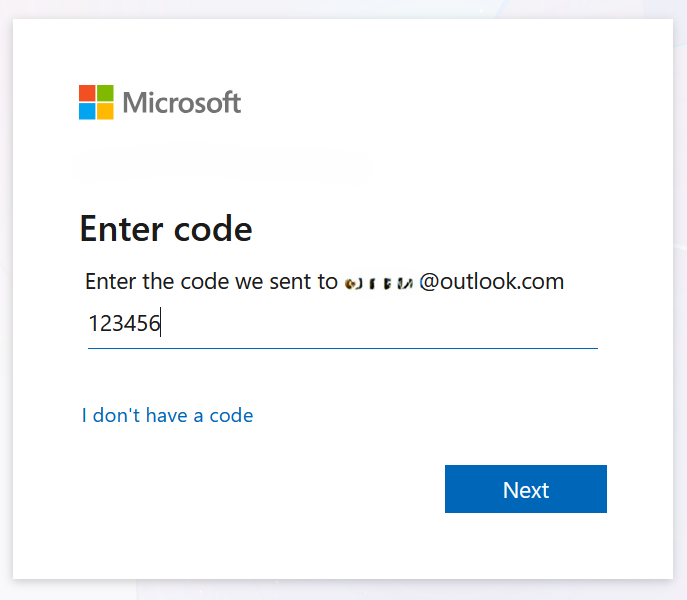

10. Complete the remaining personal-information fields required by the Azure sign-up flow.

    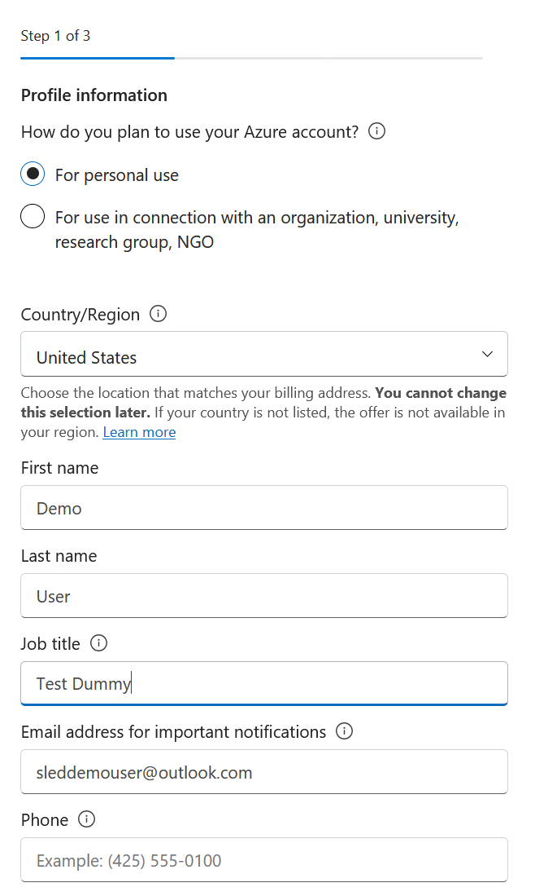

    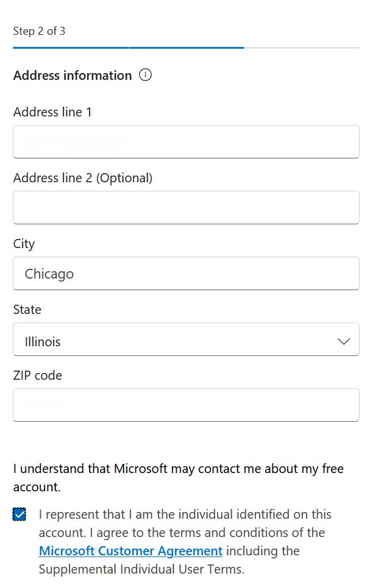

11. Enter the credit-card information requested by Azure for identity and payment verification.

    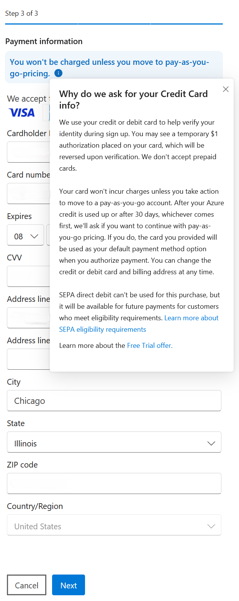

12. Complete multi-factor authentication if prompted.

    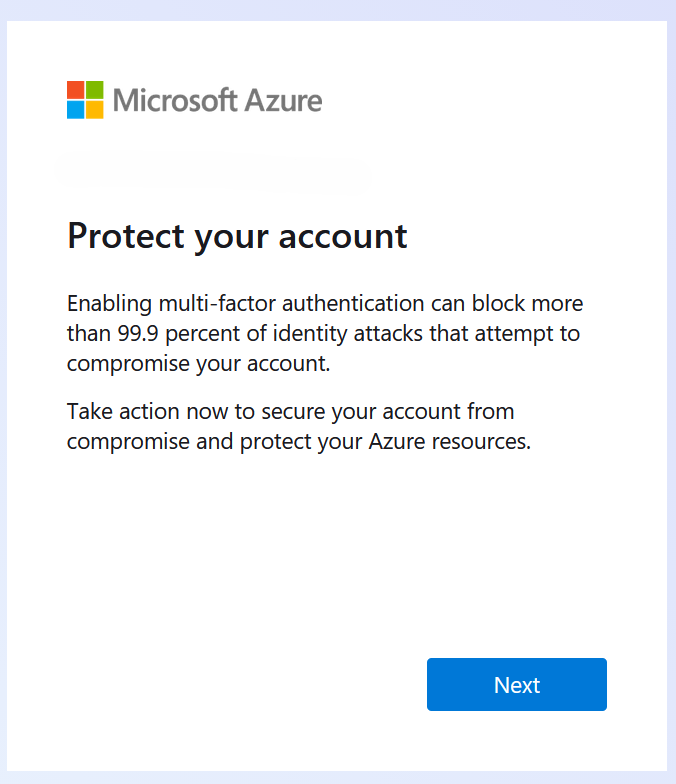

13. Review the Azure Free Account offer, Microsoft Customer Agreement, privacy statement, and applicable terms.
14. Select **Sign up**, **Create**, or the equivalent confirmation button shown in the portal.
15. Wait for Azure to finish creating the trial subscription.

    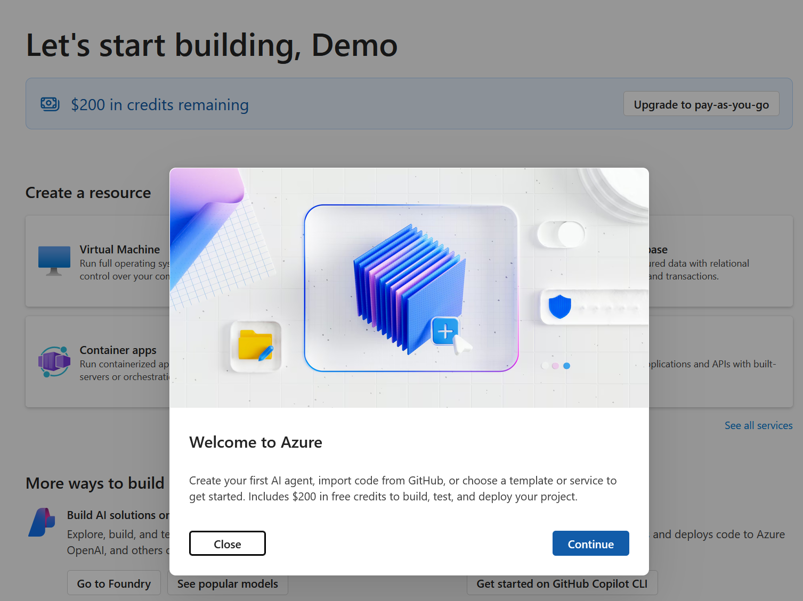

## Confirm the trial is ready

1. Open the [Azure portal](https://portal.azure.com).
2. Sign in with the account used to create the trial.
3. Search for **Subscriptions**.
4. Confirm that the new trial subscription is listed and its state is **Enabled**.
5. Record the subscription name and ID for use during the lab. Do not share personal account, payment, or verification information with presenters or in lab notes.

## Create a GitHub account

1. Open [Join GitHub](https://github.com/signup) in a private browser window.
2. Enter your email address, create a unique password, and choose an available username. Do not share your password with presenters or other attendees.
3. Select your country or region.
4. Review the **GitHub Copilot** and **Email preferences** options and select or clear them according to your preference.
5. Review GitHub's Terms of Service and Privacy Statement, then select **Create account**.

   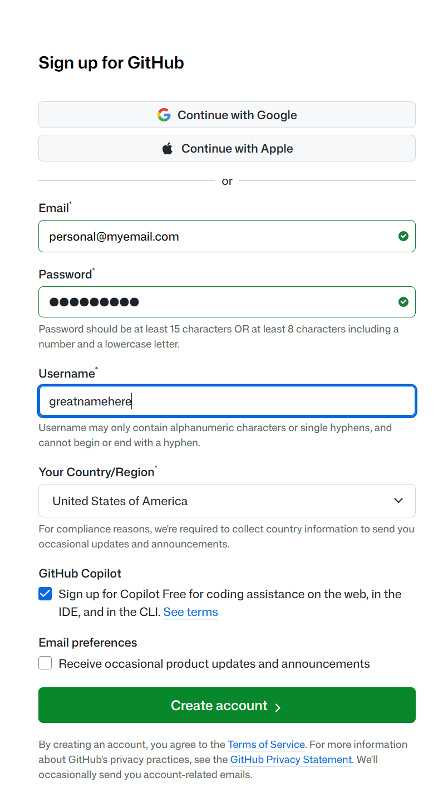

6. GitHub sends a confirmation code to the email address you entered. Retrieve the code from your email and enter it on the **Confirm your email address** page. Do not share the code.
7. Select **Continue**. If the email does not arrive, select **Resend the code** or **update your email address**.

   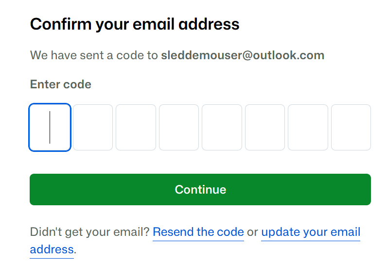

8. When GitHub confirms that the account was created, enter your username or email address and password, then select **Sign in**.

   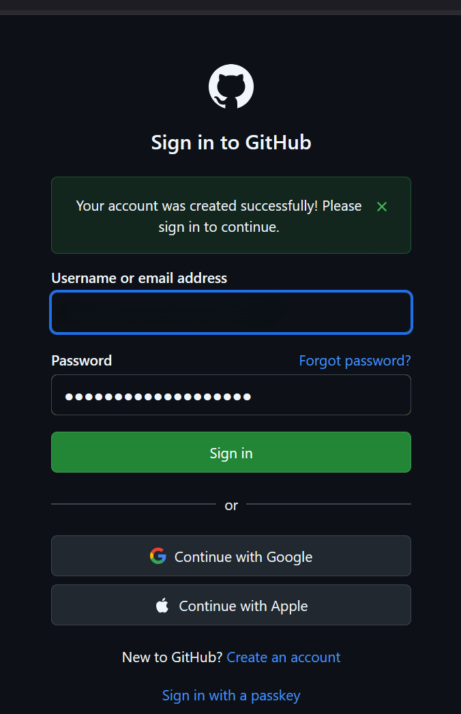

9. Confirm that your GitHub home page opens and displays your signed-in account.

## Troubleshooting

- **The free offer is unavailable:** Azure eligibility varies by country, account history, and current offer terms. Do not select a paid offer unless you independently choose to do so.
- **Verification fails:** Confirm that the account details and payment information match the information requested by Azure, then retry from a private browser window.
- **The subscription is not visible:** Confirm that you are signed in with the account used for sign-up and refresh the Subscriptions page.
- **You do not want to enter credit-card information:** Do not create the trial. Follow along with the step-by-step demonstration during the session instead.
- **GitHub verification email does not arrive:** Check the spam or junk folder, confirm the email address, and request another verification message from GitHub.

## Reference

- [Azure Free Account](https://azure.microsoft.com/free/)
- [Join GitHub](https://github.com/signup)
