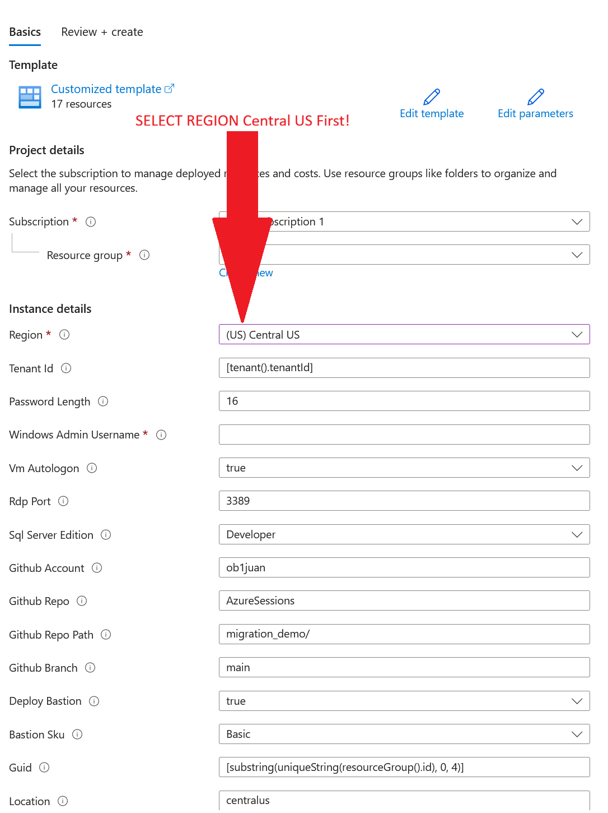
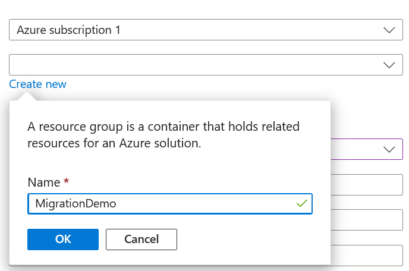
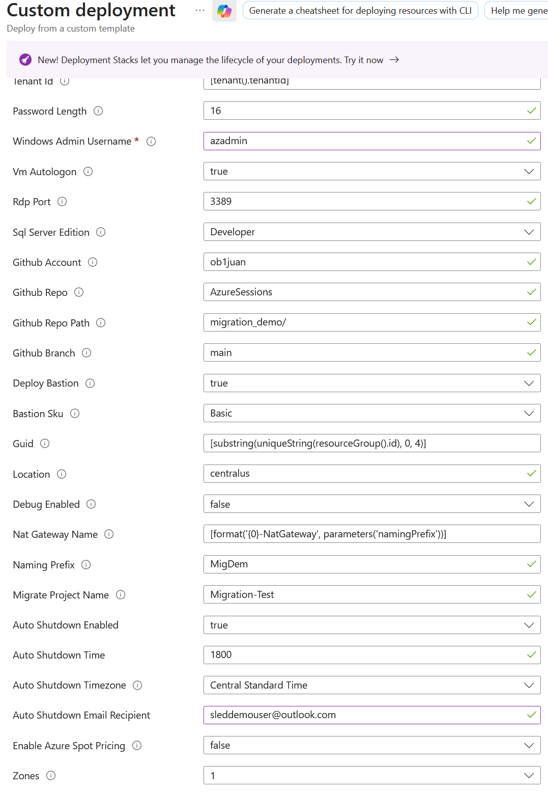
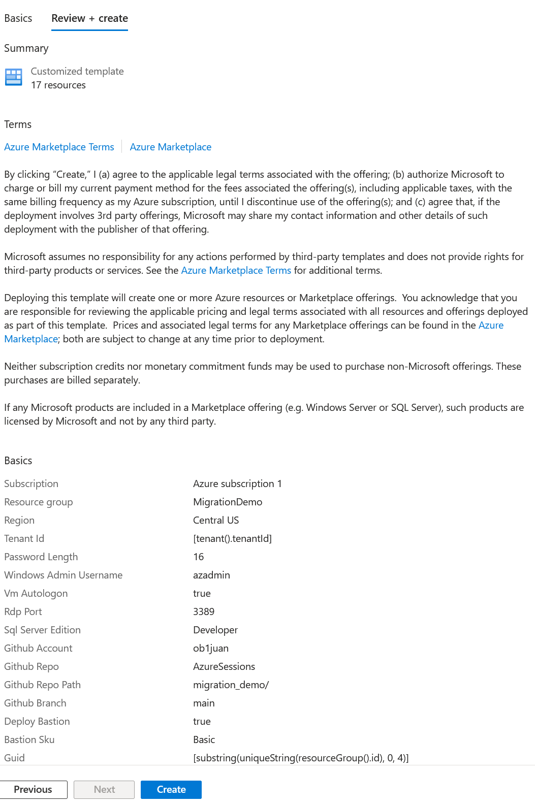
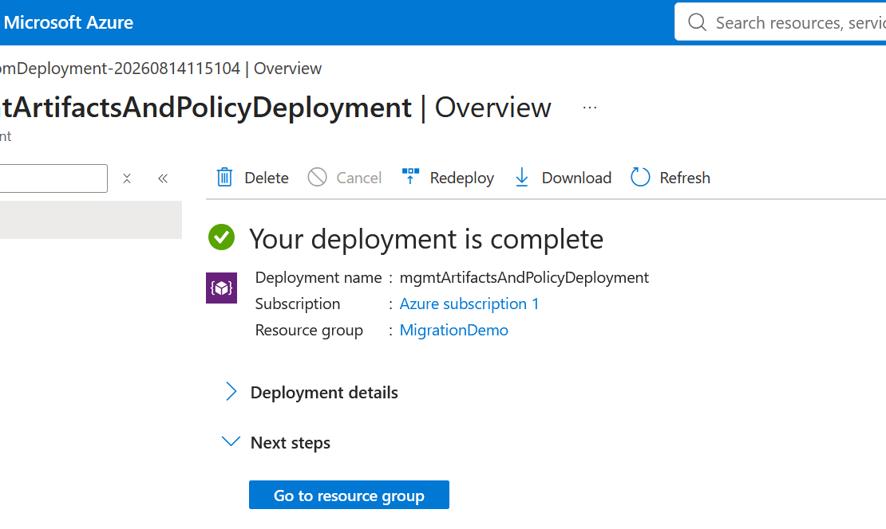
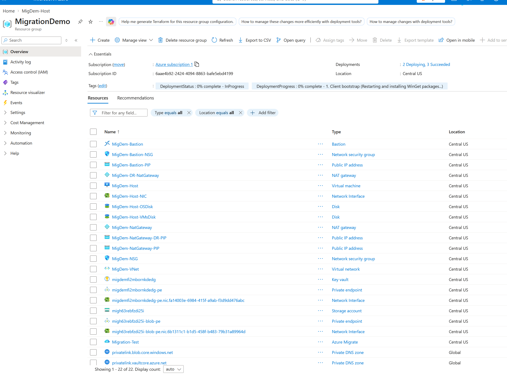

# Lab 01: Azure Deployment

Deploy the migration demo infrastructure from the Azure portal, validate the deployment, and record the values needed to connect to the host VM.

## Outcomes

- Deploy the migration demo ARM template.
- Provision the Azure client VM, virtual network, Bastion, Key Vault, storage, and supporting resources.
- Confirm that the deployment completed successfully before connecting to the host.

## Prerequisites

- Completed [Prerequisites - Trial Entra Tenant and Azure Subscription](00-prerequisites-azure-trial-setup.md).
- An enabled Azure subscription with Contributor or Owner access.
- A deployment region with sufficient quota for the template VM sizes.
- Access to the `AzureSessions` repository and its `migration_demo` path.

## Part 1: Start the deployment

1. Open the Azure portal: https://portal.azure.com.
2. Confirm that the directory and subscription from the prerequisite guide are selected.
3. Open the repository deployment experience or select **Create a resource > Template deployment (deploy using custom templates)**.
4. Select **Build your own template in the editor**, open `azure/ARM/azuredeploy.json`, and select **Save**. Alternatively, use the repository's **Deploy to Azure** button if it is available.

   

5. Select or create a resource group for the demo.

   

6. Complete the template parameters:
   - **Region:** use a region supported by Azure Migrate; the template default is `centralus`.
   - **Naming prefix:** use a short prefix of no more than seven characters; `MigDem` is the default.
   - **Migration project name:** use a unique name such as `Migration-Test`.
   - **Windows admin username:** use the value required by the lab.
   - **Deploy Bastion:** leave enabled so the host can be accessed without exposing RDP publicly.
   - **Bastion SKU:** use **Basic** unless the lab owner specifies another SKU.
   - **SQL Server edition:** use **Developer** for the demo unless a licensed edition is required.
   - **GitHub account, repository, path, and branch:** verify that they point to the source artifacts for this environment.

   

7. Select **Review + create**.

   

8. Resolve any validation errors, review the estimated resources and terms, and select **Create**.

## Part 2: Monitor deployment

1. Open the resource group and select **Deployments**.
2. Select the active deployment and monitor the operation list.
3. Wait for the deployment status to show **Succeeded**. The bootstrap process continues configuring the host and nested workloads after the base Azure resources are created.

   

4. Open **Resources** and confirm that the resource group contains the client VM, virtual network, Bastion, Key Vault, storage, and Azure Migrate resources.

   

## Part 3: Capture connection values

Record these values in the lab notes:

- Resource group name
- Subscription name and ID
- Deployment region
- Client/host VM name
- Bastion name
- Windows admin username
- Key Vault name
- Azure Migrate project name

Do not copy generated passwords into this guide or commit them to the repository. Retrieve credentials from the deployed Key Vault or the lab-provided credential flow.

## Deployment checks

- The deployment status is **Succeeded**.
- The client VM is running.
- Bastion is provisioned and attached to the virtual network.
- The Key Vault and storage resources are available.
- The Azure Migrate project resource exists.
- No unexpected resources were created in another subscription or directory.

## Troubleshooting

- **Validation fails:** Review the parameter values, region availability, provider registration, and subscription quota.
- **Deployment fails:** Open the failed operation in the deployment details and correct the reported resource or permission issue before redeploying.
- **Bastion is unavailable:** Confirm that the Bastion deployment completed and that the selected SKU is supported in the chosen region.
- **Unexpected charges are a concern:** Stop the deployment, review Cost Management, and delete the demo resource group when the lab is complete.

Continue with [Lab 02 - Login to Host VM](02-login-to-host-vm.md).
