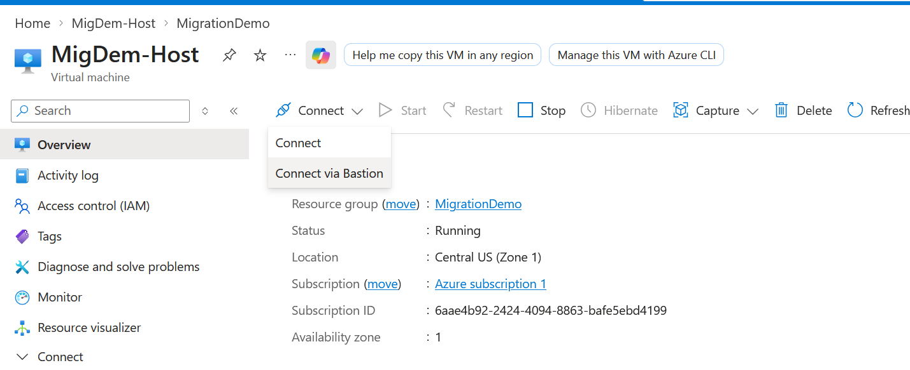
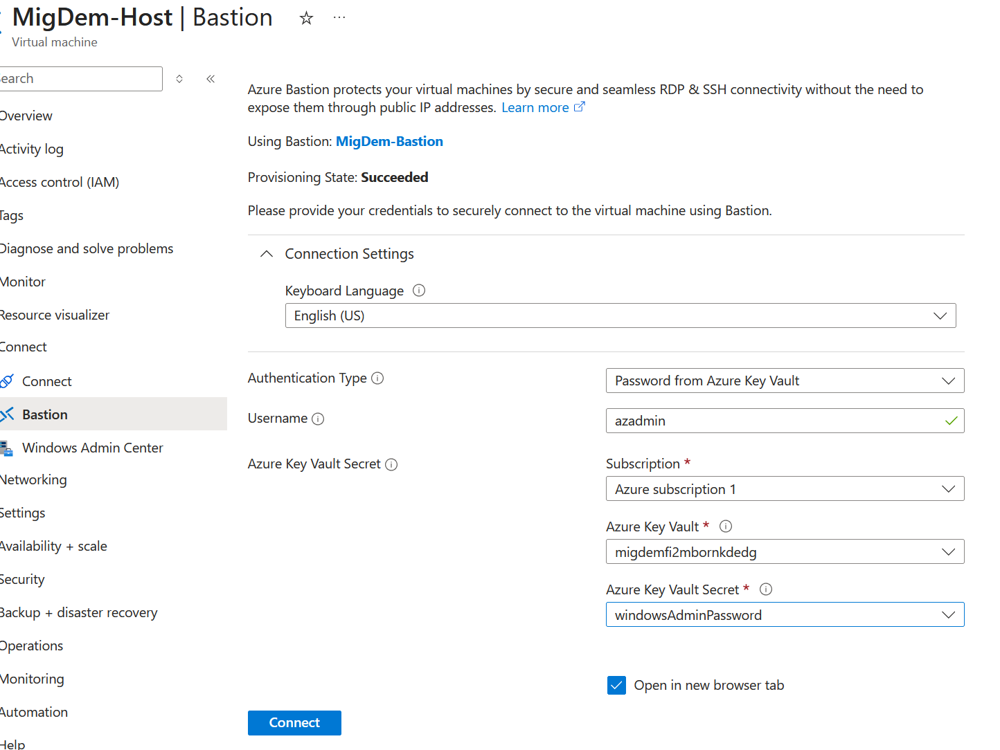
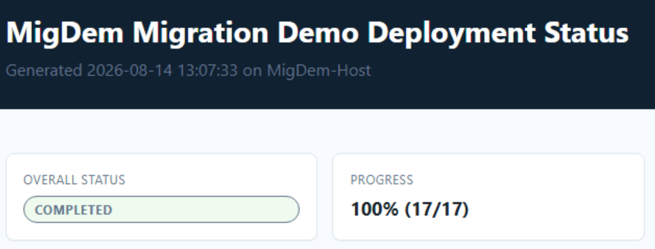
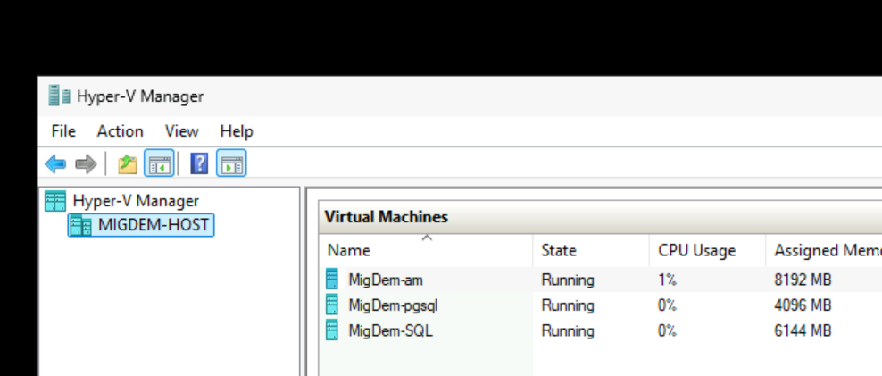

# Lab 02: Login to Host VM

Connect to the deployed Azure client VM through Azure Bastion, confirm that the Hyper-V host bootstrap has completed, and verify that the nested demo environment is progressing.

## Outcomes

- Connect to the Windows host VM without exposing RDP to the public internet.
- Confirm the host is acting as the nested Hyper-V environment.
- Check the deployment status report and identify the nested workloads.

## Prerequisites

- Completed [Lab 01 - Azure Deployment](01-azure-deployment.md).
- The client VM and Bastion show a running or successful state.
- The Windows admin username and password from the lab credential flow.

## Part 1: Connect with Azure Bastion

1. In the Azure portal, open the demo resource group.
2. Open the deployed client/host VM.
3. Select **Connect > Bastion**.

   

4. Select **Bastion** as the connection type.
5. Enter the Windows username and password. Use the generated value from the deployed Key Vault or the lab credential flow; do not use a password copied from source control.

   

6. Select **Connect** and wait for the browser-based Windows session to open.

## Part 2: Confirm the host bootstrap

1. On the host desktop, locate the migration demo shortcuts and tools.
2. Open the deployment status report or select the **Refresh Azure Deployment Status** shortcut.

   

3. Confirm that the Hyper-V feature and virtual switch setup completed.
4. Confirm that the nested workload provisioning has started or completed:
   - `migdem-iis`
   - `migdem-sql`
   - `migdem-ubuntu`
   - `migdem-am` for the Azure Migrate appliance

   

5. If the report shows in-progress components, select **Refresh** and allow the automation to continue. Do not repeatedly restart the host while bootstrap scripts are running.

## Part 3: Validate the host environment

1. Open **Hyper-V Manager** and confirm that the nested VMs are present.
2. Confirm that the host can resolve the nested VM names.
3. Confirm that the nested VMs are starting or running.
4. Use the generated desktop shortcuts to test the demo application endpoints after the status report shows the relevant components as complete.
5. Leave the host session open or record the host VM and resource group names for the Azure Migrate setup.

## Expected environment

The host VM is the Azure client VM running nested Hyper-V. The nested workloads represent the source environment for the migration demo:

| VM | Workload |
| --- | --- |
| `migdem-iis` | Windows/IIS storefront |
| `migdem-sql` | Windows/SQL Server workload |
| `migdem-ubuntu` | Ubuntu/Java/Tomcat storefront and PostgreSQL workload |
| `migdem-am` | Azure Migrate appliance |

## Troubleshooting

- **Bastion cannot connect:** Verify the VM is running, the Bastion deployment succeeded, and the correct subscription and directory are selected.
- **Credentials fail:** Retrieve the current generated credential from Key Vault or the lab credential flow. Do not reset the password unless the lab owner directs you to do so.
- **Nested VMs are missing:** Refresh the deployment status report, check the bootstrap status, and allow the host automation time to finish.
- **A nested VM is stopped:** Start it from Hyper-V Manager only after confirming that the provisioning step has completed.

Continue with [Lab 03 - Azure Migrate Setup](03-azure-migrate-setup.md).
